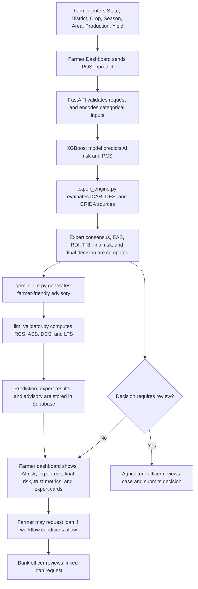
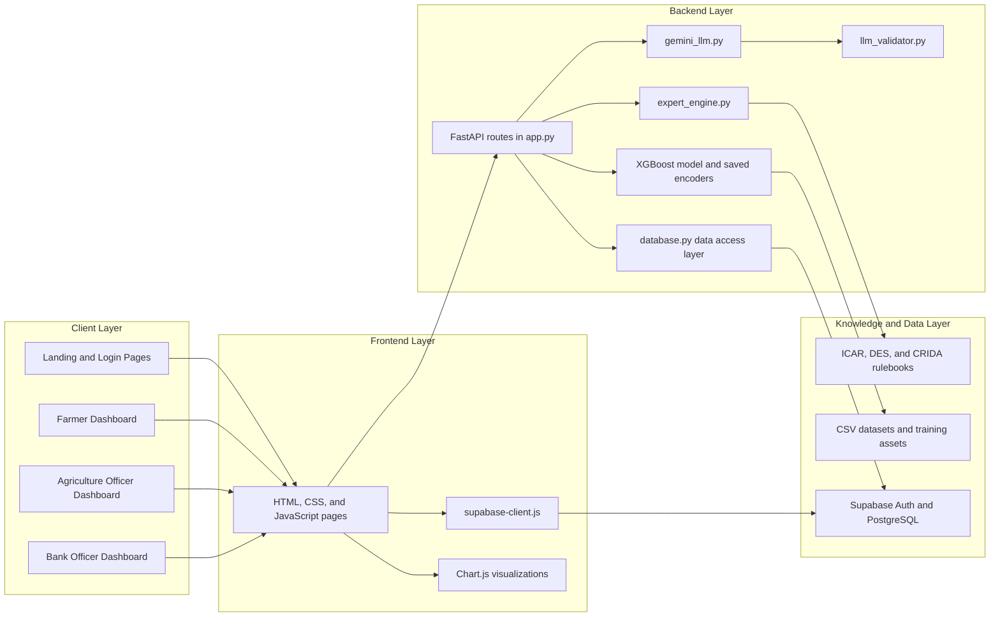

# AgriValidator AI Platform

AgriValidator AI is a role-based agricultural risk prediction and validation platform built with FastAPI, Supabase, classical machine learning, rulebook-driven expert validation, and LLM-assisted farmer advisory.

The project is designed to answer a practical question:

> If an AI model predicts crop risk, how do we validate that output before a farmer or officer acts on it?

This repository combines three layers:

1. A trained machine learning model that predicts crop risk.
2. A multi-expert validation engine built from agricultural rulebooks and benchmark data.
3. A farmer-friendly advisory layer with trust, transparency, and final decision outputs.

---

## Table of Contents

- [What This Project Does](#what-this-project-does)
- [Core Features](#core-features)
- [How the System Works](#how-the-system-works)
- [Project Implementation Methodology Diagram](#project-implementation-methodology-diagram)
- [Working Diagram](#working-diagram)
- [System Architecture Diagram](#system-architecture-diagram)
- [Trust and Validation Logic](#trust-and-validation-logic)
- [Expert Sources Used](#expert-sources-used)
- [Tech Stack](#tech-stack)
- [Project Structure](#project-structure)
- [User Roles and Dashboards](#user-roles-and-dashboards)
- [API Overview](#api-overview)
- [Input Format](#input-format)
- [Local Setup](#local-setup)
- [Environment Variables](#environment-variables)
- [Supabase Setup](#supabase-setup)
- [How to Run](#how-to-run)
- [Data and Model Assets](#data-and-model-assets)
- [Security Notes](#security-notes)
- [Known Limitations](#known-limitations)
- [Suggested Improvements](#suggested-improvements)

---

## What This Project Does

AgriValidator AI helps validate agricultural risk predictions before they are trusted for action.

The system accepts crop and field inputs such as:

- State
- District
- Crop
- Season
- Area
- Production
- Yield

From that input, the platform:

1. Predicts an AI risk level: `Low`, `Medium`, or `High`.
2. Runs a three-source expert validation process.
3. Computes trust and transparency metrics such as `PCS`, `EAS`, `RDI`, and `TRI`.
4. Generates a farmer-facing advisory.
5. Produces a final decision such as:
   - `SAFE TO PROCEED`
   - `SEND TO AGRICULTURE OFFICER`
   - `DO NOT AUTO-USE RESULT`

The platform also includes:

- batch CSV validation
- officer review workflows
- bank officer loan workflows
- audit logs
- dashboard analytics
- decision transparency reporting

---

## Core Features

### 1. AI crop risk prediction

The backend uses a trained calibrated XGBoost model to predict risk from structured agricultural input data.

### 2. Multi-expert validation

The prediction is checked against three expert sources:

- ICAR Kharif agro-advisory rulebook
- DES agricultural state/crop yield benchmarks
- ICAR-CRIDA rainfed contingency planning guidance

### 3. Final validation decision

The system does not stop at AI output. It creates a final risk and final action based on:

- AI model output
- expert consensus
- trust score thresholds
- rule-based escalation logic

### 4. Farmer-friendly advisory

The advisory layer explains:

- current crop status
- AI risk
- expert risk
- what action the farmer should take next

### 5. Trust and transparency interface

The farmer dashboard includes:

- explanation cards for trust metrics
- comparison of AI vs expert vs final decision
- expert source summaries
- LLM validation metrics

### 6. Officer review workflow

Agriculture officers can:

- inspect flagged predictions
- review prediction history
- submit decisions
- view audit logs
- inspect dashboard-level system metrics

### 7. Loan request workflow

Farmers can request loans linked to predictions, and bank officers can approve or reject them.

---

## How the System Works

### End-to-end prediction flow

1. A farmer submits crop field data from the farmer dashboard.
2. The FastAPI backend encodes categorical inputs using saved label encoders.
3. The calibrated XGBoost model predicts a risk class and confidence score.
4. The expert engine evaluates the same input against three agricultural sources.
5. AI risk and expert consensus are compared.
6. Trust scores are calculated.
7. A final risk and final validation decision are produced.
8. An LLM-generated advisory is created for farmer readability.
9. The advisory text itself is validated by a separate LLM validation module.
10. The full result is stored in Supabase and shown in the UI.

### High-level architecture

```text
Browser UI
  -> Farmer dashboard (farmer.html / farmer.js / farmer.css)
  -> Officer dashboard (index.html / app.js / styles.css)
  -> Bank officer dashboard (bank_officer.html / bank_officer.js / bank_officer.css)
  -> Shared auth helper (supabase-client.js)

FastAPI backend (app.py)
  -> authentication + role routing
  -> prediction API
  -> batch validation API
  -> officer review APIs
  -> loan APIs
  -> dashboard analytics APIs
  -> static file serving

Validation engine
  -> ML model prediction
  -> expert_engine.py
  -> gemini_llm.py (Groq-based advisory generation)
  -> llm_validator.py

Persistence
  -> Supabase Auth
  -> Supabase PostgreSQL
```

---

## Project Implementation Methodology Diagram

This diagram shows how the project is implemented from data and knowledge preparation through deployment and validation.

```mermaid
flowchart LR
    A["Problem Definition and Scope"] --> B["Collect Agricultural Data and Rulebooks"]
    B --> C["Prepare Dataset and Risk Labels"]
    C --> D["Train and Calibrate ML Models"]
    D --> E["Build Expert Validation Engine"]
    E --> F["Develop FastAPI Backend and APIs"]
    F --> G["Develop Farmer, Officer, and Bank Dashboards"]
    G --> H["Integrate Supabase Auth and Database"]
    H --> I["Add LLM Advisory and Validation Layer"]
    I --> J["Run Testing, Review, and UI Refinement"]
    J --> K["Deploy and Monitor Operational Workflow"]
```



### Methodology summary

- Data pipeline preparation creates the training and validation datasets.
- Model training provides the AI risk prediction layer.
- Expert rulebooks add deterministic validation and final decision support.
- FastAPI connects model inference, expert checks, storage, and dashboards.
- Supabase provides authentication, persistence, and workflow continuity.
- The LLM layer improves readability for farmers without replacing backend validation.

---

## Working Diagram

This diagram shows the runtime flow of a prediction request in the current system.



### Working flow summary

- The ML model provides the first risk estimate.
- The expert engine validates or challenges that estimate.
- Trust scores explain the quality of the result.
- The final decision is produced before the LLM explanation is shown.
- Officers and bank officers extend the workflow where human review is needed.

---

## System Architecture Diagram

This diagram maps the major layers and components in the current repository.



### Architecture summary

- The client layer contains the three role-specific dashboards plus shared login pages.
- The frontend layer is plain HTML, CSS, and JavaScript with shared Supabase session handling.
- The backend layer centralizes routing, validation, persistence, and business logic.
- The knowledge layer combines model files, benchmark datasets, and expert PDFs.
- Supabase supports both authentication and long-term storage of prediction and workflow records.

---

## Trust and Validation Logic

The project exposes several metrics to help explain why a prediction should or should not be trusted.

### PCS - Prediction Confidence Score

- Source: model probability
- Range: `0` to `1`
- Meaning: how confident the ML model is in its own predicted class

### EAS - Expert Agreement Score

- Range: `0` to `1`
- Meaning: how closely the AI risk aligns with the expert consensus

### RDI - Risk Deviation Index

- Range: `0` to `1`
- Meaning: how far the AI risk and expert risk are from each other
- Lower is better

### TRI - Trust Reliability Index

- Range: `0` to `100`
- Formula used in the backend:

```text
TRI = (PCS * 0.55 + EAS * 0.45) * 100
```

### LLM validation metrics

The advisory text is separately checked using:

- `RCS` - Risk Consistency Score
- `ASS` - Advisory Sentiment Score
- `DCS` - Decision Confidence Score
- `LTS` - LLM Trust Score

Formula:

```text
LTS = (0.4 * RCS + 0.4 * ASS + 0.2 * DCS) * 100
```

### Final decision rules

The current expert decision logic in `expert_engine.py` is roughly:

- If final risk is `Low`, agreement is strong, and TRI is high enough:
  - `SAFE TO PROCEED`
- If TRI is very low and AI/expert conflict is major:
  - `DO NOT AUTO-USE RESULT`
- Otherwise:
  - `SEND TO AGRICULTURE OFFICER`

This is intentional: the platform prioritizes safe escalation over blind automation.

---

## Expert Sources Used

The current three-source expert validation stack is defined in `rulebook_sources.json`.

### 1. ICAR Kharif Agro-Advisories 2025

- File: `ICAR.pdf`
- Purpose: national advisory benchmark and crop-risk thresholds

### 2. DES Agricultural Statistics at a Glance 2024-25

- File: `rulebooks/des_agricultural_statistics_glance_2024.pdf`
- Purpose: state/crop/season benchmark yield comparisons

### 3. ICAR-CRIDA Crop and Contingency Planning for Rainfed Regions of India

- File: `rulebooks/crida_rainfed_regions_india_contingency.pdf`
- Purpose: contingency and risk tightening for rainfed and stress-sensitive conditions

### Expert engine behavior

The current expert engine:

- aggregates expert opinions
- derives expert consensus
- computes agreement scores
- produces final farmer action text
- stores one validation row per expert source in Supabase

---

## Tech Stack

### Backend

- Python
- FastAPI
- Uvicorn
- Pandas
- NumPy
- scikit-learn
- XGBoost
- sentence-transformers
- requests
- PyPDF2
- Supabase Python client

### Frontend

- HTML
- CSS
- vanilla JavaScript
- Chart.js
- Supabase JS SDK

### Database and auth

- Supabase Auth
- Supabase PostgreSQL

### Advisory generation

- Groq OpenAI-compatible API
- Default advisory model in this repo: `llama-3.3-70b-versatile`

---

## Project Structure

```text
.
|-- app.py
|-- database.py
|-- expert_engine.py
|-- gemini_llm.py
|-- llm_validator.py
|-- supabase_config.py
|-- supabase-client.js
|-- rulebook_sources.json
|-- requirements.txt
|-- README.md
|-- .env.example
|
|-- farmer.html
|-- farmer.css
|-- farmer.js
|-- index.html
|-- styles.css
|-- app.js
|-- bank_officer.html
|-- bank_officer.css
|-- bank_officer.js
|-- landing.html
|-- login.html
|
|-- data/
|   |-- des_data.csv
|   |-- des_with_risk.csv
|   |-- train_data.csv
|   `-- validation_data.csv
|
|-- models/
|   |-- xgb_calibrated.pkl
|   |-- xgb.pkl
|   |-- rf.pkl
|   |-- state_enc.pkl
|   |-- dist_enc.pkl
|   |-- crop_enc.pkl
|   |-- season_enc.pkl
|   `-- risk_enc.pkl
|
|-- rulebooks/
|   |-- des_agricultural_statistics_glance_2024.pdf
|   `-- crida_rainfed_regions_india_contingency.pdf
|
|-- migration_loans.sql
|-- migration_bank_officer.sql
`-- migration_expert_validation.sql
```

---

## User Roles and Dashboards

### Farmer

Route:

```text
/farmer/dashboard
```

Main capabilities:

- submit a single crop prediction
- view final risk and trust metrics
- inspect expert rulebook outputs
- read AI advisory
- request a loan
- view prediction history

### Agriculture officer

Route:

```text
/officer/dashboard
```

Main capabilities:

- review prediction metrics
- inspect AI vs expert alignment
- submit review decisions
- inspect audit logs
- monitor dashboard-level performance

### Bank officer

Route:

```text
/bank/dashboard
```

Main capabilities:

- review loan requests
- approve or reject loan decisions
- inspect linked prediction context

### Shared login and role-based routing

Routes:

- `/`
- `/login`
- `/dashboard`

The `/dashboard` route resolves to the correct dashboard based on Supabase user metadata role.

---

## API Overview

The main FastAPI routes currently exposed by `app.py` are:

### Public and dashboard routes

- `GET /`
- `GET /login`
- `GET /farmer/dashboard`
- `GET /officer/dashboard`
- `GET /bank/dashboard`
- `GET /dashboard`

### Authentication and profile

- `POST /api/register`
- `GET /api/me`

### Prediction and validation

- `POST /predict`
- `POST /batch-validate`
- `POST /api/upload-expert-rules`
- `GET /api/expert-rules`

### Analytics and transparency

- `GET /audit-summary`
- `GET /download-report`
- `GET /api/model-metrics`
- `GET /api/crops`
- `GET /api/feature-importance`
- `GET /api/risk-heatmap`
- `GET /api/decision-transparency/{pred_id}`
- `GET /api/system-metrics`
- `GET /api/insights`
- `GET /api/prediction-history`

### Officer review

- `POST /api/officer-review`
- `GET /api/officer-reviews`
- `GET /api/audit-logs`

### Loan management

- `POST /api/loan-request`
- `GET /api/loan-requests`
- `POST /api/loan-decision`
- `GET /api/my-loans`

---

## Input Format

### Single prediction payload

The backend expects the following fields:

```json
{
  "State": "Maharashtra",
  "District": "Ratnagiri",
  "Crop": "Other pulses",
  "Season": "Rabi",
  "Area": 512,
  "Production": 800,
  "Yield": 0.10
}
```

### Batch CSV columns

For batch validation, your CSV should contain:

- `State`
- `District`
- `Crop`
- `Season`
- `Area`
- `Production`
- `Yield`

If a `Risk` column exists, the current backend drops it before processing.

---

## Local Setup

### Prerequisites

- Python 3.10+
- A Supabase project
- A Groq API key if you want live advisory generation
- Windows PowerShell or a compatible shell

### 1. Clone the repository

```bash
git clone https://github.com/AryaSadigale/AGRI_VALIDATOR.git
cd AGRI_VALIDATOR
```

### 2. Create and activate a virtual environment

Windows PowerShell:

```powershell
python -m venv venv
.\venv\Scripts\Activate.ps1
```

### 3. Install dependencies

```bash
pip install -r requirements.txt
```

### 4. Create your environment file

```bash
copy .env.example .env
```

Then fill in the real values in `.env`.

---

## Environment Variables

Create a `.env` file with at least the following values:

```env
SUPABASE_URL=your_supabase_project_url
SUPABASE_ANON_KEY=your_supabase_anon_key
SUPABASE_SERVICE_ROLE_KEY=your_supabase_service_role_key
GROQ_API_KEY=your_groq_api_key
GROQ_MODEL=llama-3.3-70b-versatile
GOOGLE_API_KEY=optional_google_key_for_list_models
```

### Notes

- `SUPABASE_SERVICE_ROLE_KEY` is required by the backend and must never be exposed in frontend code.
- `SUPABASE_ANON_KEY` is used by the frontend Supabase client.
- If `GROQ_API_KEY` is missing, the advisory system falls back to deterministic template-based advisories.
- `GOOGLE_API_KEY` is only needed for the optional `list_models.py` utility.

---

## Supabase Setup

This project depends on Supabase for:

- authentication
- profiles
- prediction history
- officer reviews
- loan requests
- audit and system logs

### Required backend setup

Update `.env` with:

- `SUPABASE_URL`
- `SUPABASE_SERVICE_ROLE_KEY`

### Frontend setup

The frontend Supabase client is configured in `supabase-client.js`.

If you move this project to a different Supabase project, update the frontend config there as well.

### SQL migrations to run

Run these SQL files in the Supabase SQL Editor:

1. `migration_bank_officer.sql`
2. `migration_loans.sql`
3. `migration_expert_validation.sql`

These migrations add:

- role support for `farmer`, `agrivalidator_officer`, and `bank_officer`
- loan request tables and policies
- expert validation storage tables and final decision columns

---

## How to Run

Start the backend:

```bash
uvicorn app:app --reload --host 127.0.0.1 --port 8000
```

Then open:

- `http://127.0.0.1:8000/`
- `http://127.0.0.1:8000/login`

Useful direct dashboard routes:

- `http://127.0.0.1:8000/farmer/dashboard`
- `http://127.0.0.1:8000/officer/dashboard`
- `http://127.0.0.1:8000/bank/dashboard`

---

## Data and Model Assets

This repository already includes:

- pre-trained model files in `models/`
- encoder files for state, district, crop, season, and risk
- dataset files in `data/`
- expert rulebook PDFs in `rulebooks/`

That means you can run the current application without retraining the model first.

### Training-related scripts

- `train_models.py`
- `evaluate_model.py`
- `split_data.py`
- `add_risk.py`

These scripts are useful if you want to retrain, extend, or re-evaluate the modeling pipeline.

---

## Security Notes

### Important

This project uses both frontend and backend Supabase access patterns.

- Keep `SUPABASE_SERVICE_ROLE_KEY` only on the backend in `.env`.
- Do not commit `.env`.
- Rotate any keys that were previously exposed during development.

### Current repository safety

This repo now includes:

- `.gitignore`
- `.env.example`

and excludes:

- `.env`
- local databases
- generated logs
- generated CSV reports
- uploads
- virtual environment files

---

## Known Limitations

- The frontend is built with vanilla HTML/CSS/JS, so component reuse is manual.
- Some advisory quality checks are still heuristic rather than domain-complete.
- The LLM validator uses a lightweight reference similarity approach, not a domain-fine-tuned agriculture evaluator.
- Batch validation currently skips live LLM generation for scale/performance reasons.
- Frontend Supabase configuration is still file-based rather than injected at build/deploy time.
- Rulebook extraction and matching are deterministic and practical, but not yet citation-perfect across every crop/state combination.

---

## Suggested Improvements

If this project continues to grow, these are the most useful next improvements:

1. Add automated tests for prediction, expert validation, and API responses.
2. Add Docker support for one-command setup.
3. Move frontend Supabase config to environment-driven deployment settings.
4. Add richer README screenshots and example API responses.
5. Add stronger schema migrations and seed scripts.
6. Add monitoring and structured logging for production deployment.
7. Add unit tests around final decision logic and expert consensus edge cases.
8. Add model/version metadata to prediction records for better auditability.

---

## Repository Status

This repository is intended as a practical full-stack AI validation system for agricultural risk workflows, not just a simple ML demo.

It already includes:

- trained model artifacts
- UI dashboards
- Supabase integration
- expert validation logic
- LLM advisory generation
- trust scoring
- decision escalation workflows
- loan review support

If you want to extend it, the best starting points are:

- `app.py`
- `expert_engine.py`
- `database.py`
- `farmer.js`
- `app.js`
